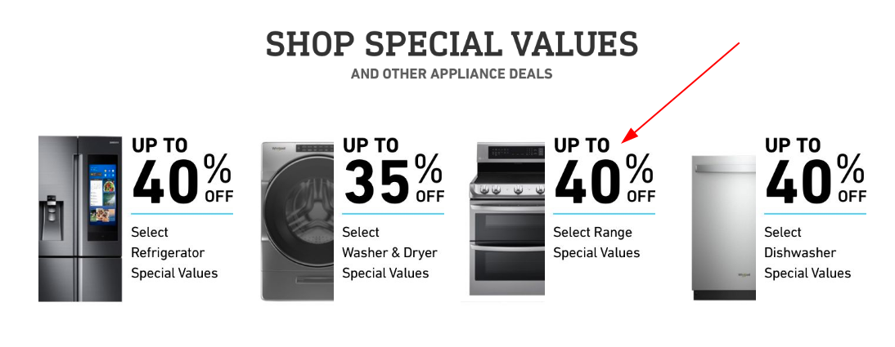
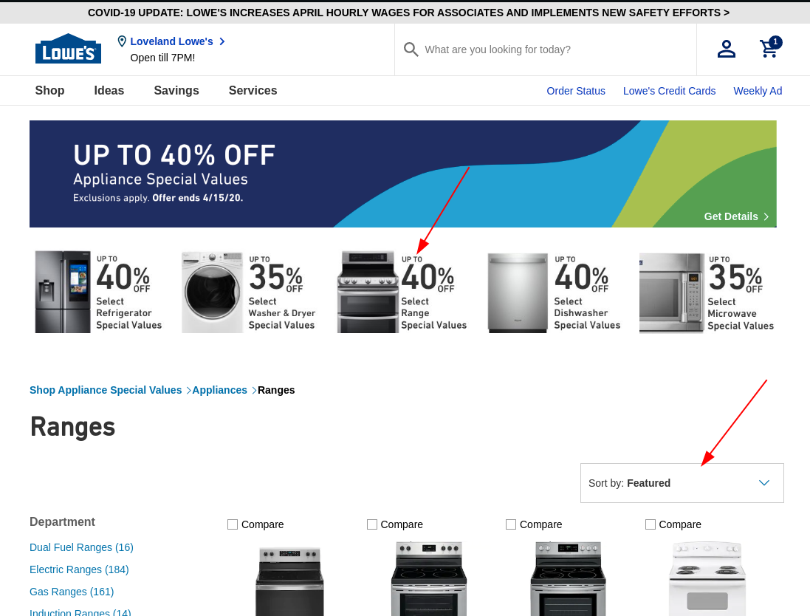
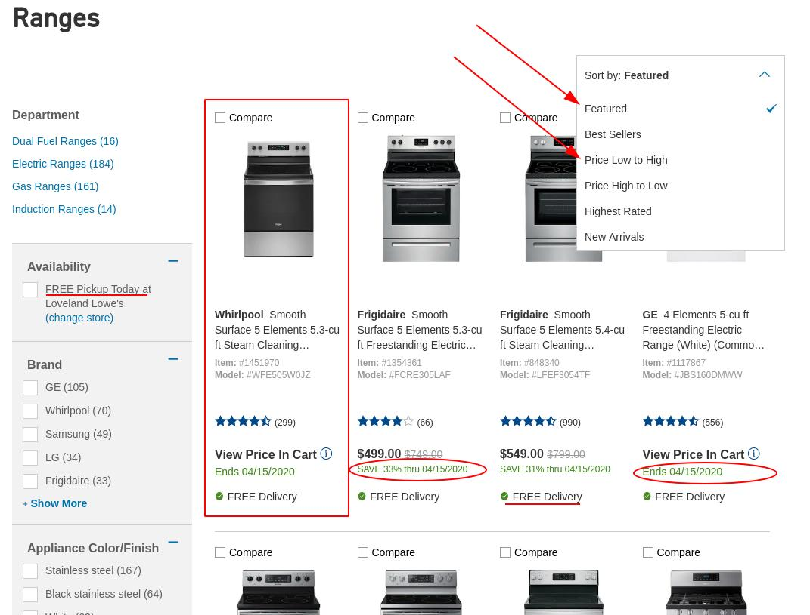

# Why are big companies so bad at ecommerce?

There's so much business opportunity in the ecommerce space it's absurd. Every time I go on a major companies site it's upsetting. The dearth of leadership and talent in the biggest retailers means that the online space is wide open to competitors. I briefly went onto Lowes to check out some stoves, mine is not great and what I saw was awful. The Lowes website does nothing for the customer. There's no energy spent thinking about what the customers needs are, and instead a mass of energy spent being sure to list the products. Let's take a look.

## What happens when you click

On the Lowes homepage there's the following call to action, since I am shopping for a stove I selected 40% off stoves. 

This brings you to the following category landing page.

Let's review what's wrong with this page. Roughly 20% of content is targeted at letting the customer whose journey is "select range special values" know how to read the fine print. Another 20% is encouraging that same shopper to shop for something other than their previously selected choice. In total, 40% of the above the fold content is devoted to encouraging the customer to shop elsewhere. The only place that confirms to our customer that they are, in fact, in the right place is the breadcrumbs. The product sort dropdown is "featured" products, with no mention that these are the up to 40% off featured products. Further, the user can't sort by percentage off. Contrast this with the retail experience of a sale. Each item that's on sale will be prominetly tagged, perhaps grouped together. There will be signage throughout the store driving the customer to the sale, not signage at the sale driving customers elsewhere. This can all be handled by a developer mapping the customers journey, showing and hiding some content, and choosing layouts that make sense for the customers journey.

## What about the rest of the page, that's better right?

Perhaps as we scroll down the page and get into the content we'll have an improved experience.

This isn't as terrible. There's absolutely nothing right about it, but it's as bad as everyones ecommerce site. For some unknown reason, we have narrow product cards for these items, despite knowing quite a lot about the customer that's visiting our site. They've chosen to see up to 40% off stoves and we're showing them as little information as possible on a narrow card. This customer has said, with their actions, that they are seeking a stove during a limited time sale. Imagine giving them high info cards 2 x 2 rather than these. Worse still, what information is displayed and how? We show on every card that free delivery is an option.