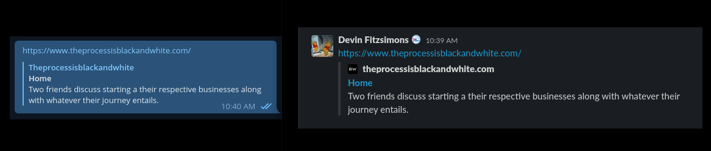
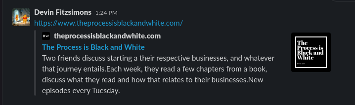

## How can we best update tags for social sharing 

For my weekly podcast [The Process is Black and White](https://www.theprocessisblackandwhite.com/) I just threw together a quick and dirty Gatsby site. I've invested no more than an hour or two on this site, since I have other projects I'm focused on, rather than making this site super clean and slick. Gatsby generally provides enough out of the box that you can just get going, that's why I love it. Sharing links for the show however, revealed a problem.



If the goal of the show is to get some new listeners, these two previews generated by Telegram and Slack aren't exactly what we're trying to achieve. Fortunately, this is relatively straightforward to update. Mostly, this kind of thing is done through something called Meta Tags. They work like HTML, and provided you use them right, add some information when people share your site. While straightforward to update, it's an extremely annoying thing to google since everything about Meta tags is unhelpful as everyone is trying to sell you SEO services. Here are a couple notes for what you should add and know.

 - Add an image. This will count for an `og` image, a `twitter:image` and a regular image. They can all be the same image, and the same size.
 - Add an image size, I haven't done this yet, but will likely get around to it soon.
 - `og` which you'll see when you're putting these tags together stands for Open Graph. It's a spec and better to google than anything SEO related,
 - Try to make sure that the description and title makes sense for sharing. Without updating I had "Home" on mine, once it was updated it made more sense. 
 - One gotcha I ran into was that my solution meant I need to create a static folder for these images, in the future I'll improve this.

I didn't really add much. I swapped the title with the site's title when it's "Home", passed an image along, and made sure that future me, could pass an image along for custom images in the future. I'll add size attributes at some point and turn this into more of a blog post than a quick tip, but for now, if you're a developer, this should roughly explain what's happening in my `<Helmet />` tag.
 
```jsx
  const metaDescription = description || site.siteMetadata.description
  const cardImage = `${site.siteMetadata.siteUrl}${image || site.siteMetadata.image}`
  const seoTitle = title === "Home" ? site.siteMetadata.title : title || site.siteMetadata.title

  return (
    <Helmet
      htmlAttributes={{
        lang,
      }}
      title={title}
      titleTemplate={`%s | ${site.siteMetadata.title}`}
      meta={[
        {
          name: `description`,
          content: metaDescription,
        },
        {
          name: `image`,
          content: cardImage,
        },
        {
          name: `og:image`,
          content: cardImage,
        },
        {
          property: `og:title`,
          content: seoTitle,
        },
        {
          property: `og:url`,
          content: site.siteMetadata.siteUrl,
        },
        {
          property: `og:description`,
          content: metaDescription,
        },
        {
          property: `og:type`,
          content: `website`,
        },
        {
          name: `twitter:card`,
          content: `summary`,
        },
        {
          name: `twitter:creator`,
          content: site.siteMetadata.author,
        },
        {
          name: `twitter:title`,
          content: seoTitle,
        },
        {
          name: `twitter:description`,
          content: metaDescription,
        },
        {
          name: `twitter:image`,
          content: cardImage,
        },
        {
          name: `twitter:image:alt`,
          content: 'Show logo for Process is black and white',
        },
      ].concat(meta)}
    />
  )
}
```

The results were actually pretty great! I was pleased to find Slack's image now had the show logo, an improved description and a better title when someone shares the homepage. Pretty sweet for what amounted to a minimal effort. 



I think, a nice clean, well tested component that handles this for me, perhaps even generating some schema, would be great! That's going to end up as a todo for this site for sure. This sort of technical SEO seems like such low hanging fruit that I hope I can gather up some resouces so anyone can do it well. 